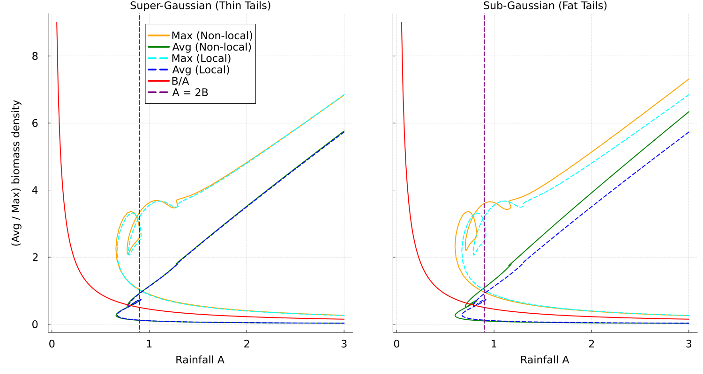

# Numerical Analysis of the Klausmeier Vegetation Model with Non-local Dispersal

This repository contains the Julia code for the numerical analysis of the Klausmeier vegetation model, extended to include non-local dispersal on finite, one-dimensional domains. The project investigates critical patch sizes for vegetation survival and explores the complex bifurcation structures that emerge under different dispersal strategies.

The primary numerical tool used is the **BifurcationKit.jl** package, which enables pseudo-arclength continuation to trace solution branches and detect bifurcation points.

## Key Results

### 1. Critical Patch Size

We investigate how the minimum habitat size required for vegetation persistence (the "critical patch size") is influenced by the shape of the dispersal kernel. We compare the classical local (reaction-diffusion) model with two non-local models using kernels with "thin tails" (Super-Gaussian) and "fat tails" (Sub-Gaussian).


*Figure 1: Comparison of average biomass density as a function of patch half-width L. The non-local model with fat tails (orange) is the most resilient, persisting in the smallest habitats.*

### 2. Bifurcation Diagrams

We analyze how stationary solutions change with respect to the rainfall parameter `A`. The analysis reveals complex, looping solution branches, especially in the "fast diffusion" regime, indicating a cascade of secondary bifurcations.


*Figure 2: Bifurcation diagrams for the fast diffusion regime ($d_w = 80.0$). The fat-tailed Sub-Gaussian kernel (right) produces significantly more complex oscillations than the thin-tailed Super-Gaussian kernel (left).*

## The Model

The system models the interaction between vegetation biomass $u(x,t)$ and water concentration $w(x,t)$. The key feature is the non-local dispersal operator for biomass:
$$
\mathcal{L}u(x) = \int_{\Omega} J(x-y)u(y)dy - u(x)
$$
where $J(x)$ is the dispersal kernel. Our analysis focuses on how the shape of this kernel influences the system's dynamics.

## Experiments

The repository contains code for two main numerical experiments:

1.  **Critical Patch Size Analysis**: This script (`pipeline/run-critical-patch.jl`) simulates the model for a range of patch sizes `L` to find the minimum size for vegetation survival under different dispersal kernels (local, thin-tailed, fat-tailed).
2.  **Bifurcation Analysis**: This script (`pipeline/run-bifurcation.jl`) uses `BifurcationKit.jl` to generate bifurcation diagrams with respect to the rainfall parameter `A`. It compares the results for different kernels and diffusion rates.

## Repository Structure
Doskonale. Analiza struktury Twojego repozytorium jest kluczowa, aby stworzyć idealne `README`. Dziękuję za wklejenie listy plików – widzę na niej kilka bardzo ważnych rzeczy, które musimy uporządkować.

**Najważniejsza rzecz na początek: Plik `.gitignore`**

Twoje repozytorium zawiera foldery, które **nigdy nie powinny być częścią repozytorium Git**, takie jak `.venv/` (środowisko wirtualne Pythona) i `.idea/` (ustawienia Twojego edytora). Powodują one, że repozytorium jest "zaśmiecone" i znacznie większe niż powinno.

Musimy to naprawić, zanim zajmiemy się plikiem `README`.

---

### Krok 0: Sprzątanie Repozytorium (bardzo ważne!)

1.  **Stwórz plik `.gitignore`**
    W głównym folderze `KLAUSMEIER-MODEL/` stwórz plik o nazwie `.gitignore` (z kropką na początku) i wklej do niego poniższą zawartość. Możesz to zrobić w terminalu komendą `nano .gitignore`.

    ```gitignore
    # Julia
    *.log
    *.out

    # Python Virtual Environments
    .venv/
    venv/
    ENV/

    # IDE and editor files
    .idea/
    *.swp

    # OS generated files
    .DS_Store
    Thumbs.db
    ```

2.  **Usuń niepotrzebne foldery z repozytorium Git (ale nie z dysku!)**
    Otwórz terminal w folderze projektu i wykonaj poniższe komendy. Usuną one śledzenie tych folderów przez Git.

    ```bash
    git rm -r --cached .venv/
    git rm -r --cached .idea/
    git rm -f .README.md.swp
    ```
    *Flaga `--cached` sprawia, że pliki są usuwane tylko z repozytorium, a nie z Twojego komputera.*

3.  **Zatwierdź zmiany**
    Teraz dodaj plik `.gitignore` i zatwierdź usunięcie niepotrzebnych folderów.
    ```bash
    git add .gitignore
    git commit -m "Add .gitignore and remove tracked virtual env and IDE files"
    git push
    ```

Po wykonaniu tych kroków Twoje repozytorium będzie czyste i profesjonalne.

---

### Ostateczny Plik `README.md`

Teraz, gdy Twoje repozytorium jest uporządkowane, oto finalna wersja pliku `README.md`. Skopiuj cały poniższy tekst i wklej go do pliku `README.md` w głównym folderze projektu. Zaktualizowałem ścieżki do plików i format obrazów na podstawie Twojej struktury.

```markdown
# Numerical Analysis of the Klausmeier Vegetation Model with Non-local Dispersal

This repository contains the Julia code for the numerical analysis of the Klausmeier vegetation model, extended to include non-local dispersal on finite, one-dimensional domains. The project investigates critical patch sizes for vegetation survival and explores the complex bifurcation structures that emerge under different dispersal strategies.

The primary numerical tool used is the **BifurcationKit.jl** package, which enables pseudo-arclength continuation to trace solution branches and detect bifurcation points.

## Key Results

### 1. Critical Patch Size

We investigate how the minimum habitat size required for vegetation persistence (the "critical patch size") is influenced by the shape of the dispersal kernel. We compare the classical local (reaction-diffusion) model with two non-local models using kernels with "thin tails" (Super-Gaussian) and "fat tails" (Sub-Gaussian).


*Figure 1: Comparison of average biomass density as a function of patch half-width L. The non-local model with fat tails (orange) is the most resilient, persisting in the smallest habitats.*

### 2. Bifurcation Diagrams

We analyze how stationary solutions change with respect to the rainfall parameter `A`. The analysis reveals complex, looping solution branches, especially in the "fast diffusion" regime, indicating a cascade of secondary bifurcations.


*Figure 2: Bifurcation diagrams for the fast diffusion regime ($d_w = 80.0$). The fat-tailed Sub-Gaussian kernel (right) produces significantly more complex oscillations than the thin-tailed Super-Gaussian kernel (left).*

## The Model

The system models the interaction between vegetation biomass $u(x,t)$ and water concentration $w(x,t)$. The key feature is the non-local dispersal operator for biomass:
$$
\mathcal{L}u(x) = \int_{\Omega} J(x-y)u(y)dy - u(x)
$$
where $J(x)$ is the dispersal kernel. Our analysis focuses on how the shape of this kernel influences the system's dynamics.

## Experiments

The repository contains code for two main numerical experiments:

1.  **Critical Patch Size Analysis**: This script (`pipeline/run-critical-patch.jl`) simulates the model for a range of patch sizes `L` to find the minimum size for vegetation survival under different dispersal kernels.
2.  **Bifurcation Analysis**: This script (`pipeline/run-bifurcation.jl`) uses `BifurcationKit.jl` to generate bifurcation diagrams with respect to the rainfall parameter `A`.

## Repository Structure

```
.
├── data/                   # Contains the output SVG figures.
├── pipeline/
│   ├── run-bifurcation.jl  # Script for generating bifurcation diagrams.
│   └── run-critical-patch.jl # Script for the critical patch size experiment.
├── .gitignore              # Specifies intentionally untracked files to ignore.
├── Project.toml            # Julia project dependencies.
├── Manifest.toml           # Exact versions of dependencies for reproducibility.
└── README.md               # This file.
```

## Getting Started (Terminal-Only Workflow)

These instructions allow you to set up the environment and run the experiments directly from your system's terminal.

1.  **Clone the repository:**
    ```bash
    git clone https://github.com/tadejow/klausmeier-model.git
    cd klausmeier-model
    ```

2.  **Instantiate the Julia environment from the terminal:**
    This command downloads and installs all necessary packages specified in `Project.toml`.
    ```bash
    julia --project=@. -e 'using Pkg; Pkg.instantiate()'
    ```
    This only needs to be done once.

3.  **Run an experiment:**
    Execute any of the scripts directly from your terminal:
    ```bash
    julia pipeline/run-bifurcation.jl
    ```
    or
    ```bash
    julia pipeline/run-critical-patch.jl
    ```
    The scripts will run the simulations and save the resulting plots to the `data/` directory.

## Citation

This results are soon to be published!
